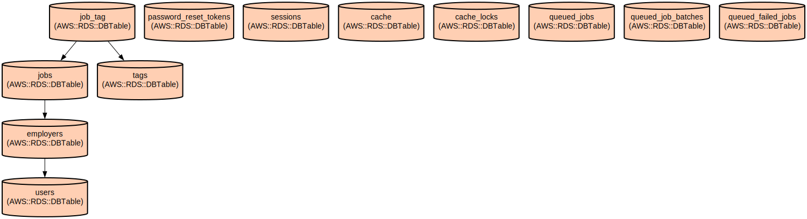

# Job Board Platform - A Modern Laravel-based Job Posting and Management System

A robust job board platform built with Laravel that enables employers to post and manage job listings while providing job seekers with an intuitive interface to discover opportunities. The platform features user authentication, company profile management, and a tagging system for better job categorization.

The application provides a streamlined experience for both employers and job seekers through a modern interface built with Tailwind CSS and Alpine.js. Employers can create detailed job postings with comprehensive information including salary, location, and schedule, while job seekers can easily browse and filter jobs based on various criteria.

## Repository Structure
```
.
├── app/                          # Application core code
│   ├── Http/Controllers/        # Request handlers for jobs, users, and profiles
│   ├── Models/                  # Eloquent models (User, Job, Employer, Tag)
│   └── Policies/               # Authorization policies for jobs and employers
├── database/                    # Database related files
│   ├── factories/              # Model factories for testing and seeding
│   ├── migrations/             # Database structure definitions
│   └── seeders/               # Seed data for development
├── resources/                  # Frontend assets and views
│   ├── css/                   # Stylesheets including Tailwind CSS
│   ├── js/                    # JavaScript files with Alpine.js
│   └── views/                 # Blade templates for UI components
├── routes/                    # Application routes definition
│   └── web.php               # Web routes for job board functionality
└── tests/                    # Application tests
    └── Unit/                # Unit tests for models
```

## Usage Instructions
### Prerequisites
- PHP >= 8.2
- Composer
- Node.js and npm
- MySQL or PostgreSQL database
- Laravel CLI

### Installation

1. Clone the repository:
```bash
git clone <repository-url>
cd job-board
```

2. Install PHP dependencies:
```bash
composer install
```

3. Install JavaScript dependencies:
```bash
npm install
```

4. Configure environment:
```bash
cp .env.example .env
php artisan key:generate
```

5. Set up the database:
```bash
php artisan migrate
php artisan db:seed
```

### Quick Start

1. Start the development server:
```bash
php artisan serve
```

2. Start the Vite development server:
```bash
npm run dev
```

3. Access the application at `http://localhost:8000`

### More Detailed Examples

1. Creating a job posting:
```php
// As an employer
POST /jobs/create
{
    "title": "Senior Developer",
    "description": "Looking for an experienced developer...",
    "salary": "$120,000 - $150,000",
    "location": "Remote",
    "schedule": "full-time",
    "tags": ["php", "laravel", "vue"]
}
```

2. Managing user profile:
```php
// Update user profile
POST /user/profile
{
    "first_name": "John",
    "last_name": "Doe",
    "email": "john@example.com"
}
```

### Troubleshooting

1. Database Connection Issues
- Error: `SQLSTATE[HY000] [2002] Connection refused`
  - Check database credentials in `.env`
  - Ensure database service is running
  - Verify database exists and is accessible

2. Asset Compilation Issues
- Error: `npm run dev` fails
  - Clear node_modules and reinstall: `rm -rf node_modules && npm install`
  - Check for Node.js version compatibility
  - Verify Vite configuration in `vite.config.js`

## Data Flow
The application follows a standard MVC architecture with a focus on job posting and management.

```ascii
User/Employer -> Authentication -> Job Management
     │                                │
     └─────────> Profile ────────────>│
                Management           Jobs
                    │                 │
                    v                 v
                Database <─── Tags/Categories
```

Key component interactions:
- User authentication flows through the UserController
- Job creation and management handled by JobController
- Profile updates managed by ProfileController
- Employer-specific operations controlled by EmployerPolicy
- Job data validated and stored with associated tags
- File uploads handled for employer logos
- Session management for user state
- Cache implementation for performance optimization

## Infrastructure


The application uses several key database tables:

- `users`: Stores user authentication and profile data
  - Primary user information including name and email
  - Authentication credentials and verification status

- `employers`: Company/employer profiles
  - Links to user accounts
  - Company details and logos

- `jobs`: Job posting information
  - Complete job details including title, description, salary
  - Relationships to employers and tags
  - Featured status tracking

- `tags`: Job categorization system
  - Tag names and relationships
  - Many-to-many relationship with jobs